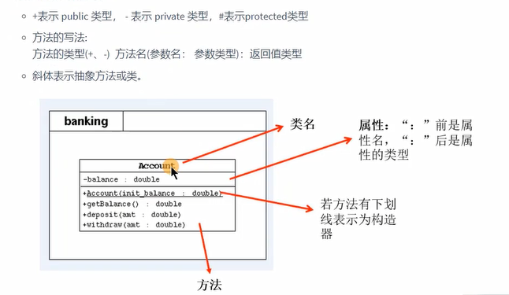

属性赋值过程、javaBean、类图UML
```
1、在类的属性中 可以有哪些位置给属性赋值
    1   默认值
    2   类中显式赋值
    3   构造器赋值
    4   对象-方法赋值
    5   对象-属性赋值

2、这些位置的先后执行顺序是怎么样的
    默认值
    显式赋值
    构造器赋值
    对象-方法赋值 | 对象-属性赋值

3、以上操作在对象创建过程中可以执行的次数如何


二、JavaBean的理解
    一种Java语言写成的可重用组件

符合如下标准的java类 称为 javaBean
    类是公共的
    有一个无参的公共构造器
    有属性，且有对应的 get set 方法

用户可以javaBean将功能、处理、值、数据库访问和其他任何可以用java代码创造的对象进行打包
并且其他开发者可以通过 jsp页面、Servlet、其他javabean、程序来使用这些对象
javabean提供了一种随时随地的复制粘贴的功能，而不用关心任何改变


三、读懂UML类图
统一建模语言  Unified Modeling Languag  用来描述 软件模型 和 架构 的图形化语言

powerDesinger、 Rose 、 Enterprise Architect

在软件开发中 UML类图 可以直观的描述内部结构（类的属性和操作）以及类之间的关系（关联、依赖、聚合）
```

